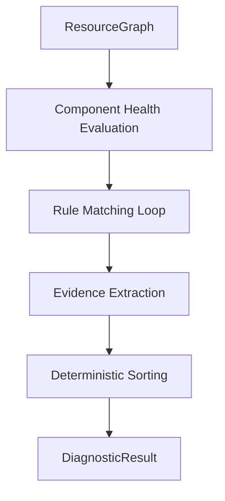

# Phase 2 - Diagnostic Engine Design

## 1. Overview & Purpose

The **Resource Mapper** (Phase 1) provides a structured *observation* of the current state (a `ResourceGraph`). It tells us *what* exists (e.g., "Worker StatefulSet has 2/3 replicas ready").

The **Diagnostic Engine** (Phase 2) provides a *diagnosis*. It tells us *why* it matters and *what* to do (e.g., "Worker is partially ready, likely causing data unavailability. Check for OOMKilled pods.").

**Why mapping alone is insufficient:**
-   **Cognitive Load**: A user looking at a graph with 20 components needs to know which one is the root cause.
-   **Context**: A "Pending" PVC is normal during creation but critical after 5 minutes. The mapper just sees "Pending"; the diagnoser applies the "Critical" label based on context (though mostly static rules for now).
-   **Actionability**: Mapping describes state; Diagnosis prescribes action.

## 2. Input/Output Contract

-   **Input**: `ResourceGraph` (Typed, Read-Only, Snapshot of Cluster State).
-   **Output**: `DiagnosticResult` (Typed, Serializable, Deterministic Report).

## 3. Diagnostic Pipeline

The pipeline is designed to be a pure function: `f(Graph) -> Result`.

## 4. Failure Rule Model

Each rule implements the `Rule` interface and defines specific criteria for failure.

| Rule ID | Severity | Component | Trigger Condition | Suggestion |
| :--- | :--- | :--- | :--- | :--- |
| `DATASET_NOT_BOUND` | Critical | Dataset | Dataset Phase != "Bound" | Check for compatible Runtime. |
| `RUNTIME_MISSING` | Critical | Runtime | Runtime struct is nil | Create Runtime CR. |
| `MASTER_NOT_READY` | Critical | Master | Master Ready < Replicas | Check Master logs/scheduling. |
| `WORKER_PARTIALLY_READY` | Warning | Worker | Worker Ready < Replicas | Check for OOM/CrashLoop. |
| `FUSE_MISSING` | Warning | Fuse | Fuse Ready == 0 (when replicas > 0) | Check Node Selectors/Tolerations. |
| `PVC_NOT_BOUND` | Critical | Storage | PVC Status != "Bound" | Check PV/StorageClass. |

## 5. Determinism Guarantees

To ensure `fluidctl` is suitable for CI/CD and regression testing:
1.  **Fixed Rule Order**: Rules are executed in a hardcoded slice order, not map iteration.
2.  **Stable Output**: Hints are sorted by Severity → Component → Rule ID before returning.
3.  **No Internal Timestamps**: The `FailureHint` itself does not contain generation timestamps, ensuring the JSON output is identical for identical inputs.

## 6. Mock-Mode Compatibility

Since the engine acts on the `ResourceGraph` struct, it is agnostic to the data source.
-   **Real Mode**: Graph is populated by K8s API calls.
-   **Mock Mode**: Graph is populated by a specific MockProvider.

This enables trivial unit testing of the diagnostic logic without spinning up Kind/Minikube.
